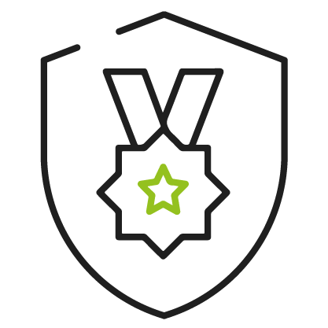

* 👋 Hey, my name is Guilherme, I usually use the @fotkurz nickname mostly because I use it since I was 12 (I did read in some random website, that I could translate my name to black speech to Fotkurz.) I know, it means something like little foot in german I think).
  
* :rocket: I'm currently working as a Junior Developer at <a href="https://github.com/ZupIT">Zup</a> and I'm really proud of it. :rocket: 

<h3 align=center>Languages</h3>

 
  
  
  

<h3 align=center>Frameworks</h3>

 
  
  
  

<!--

 

Thanks <a href="https://github.com/anuraghazra/github-readme-stats">anuraghazra</a>
<!---
Fotkurz/Fotkurz is a ✨ special ✨ repository because its `README.md` (this file) appears on your GitHub profile.
You can click the Preview link to take a look at your changes.
--->
